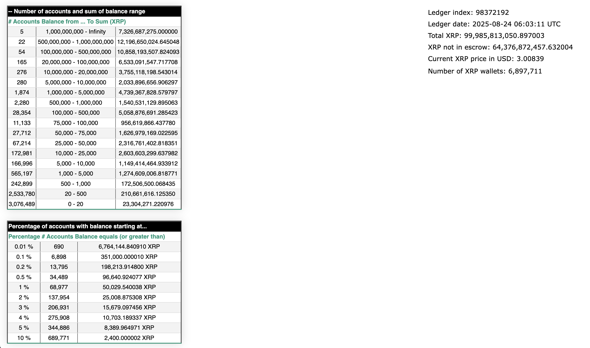

## 1. Introduction

Comment mener au mieux ce projet et quels sont les meilleurs choix qui s'offre à moi ?

Je souhaite réaliser un site web qui doit afficher plusieurs informations à propos du réseau XRP.

Le but du site est de pouvoir faire un projet open-source et de permettre à toute personne
de consulter chaque adresse du réseau XRP. J'aimerais pouvoir afficher plusieurs statistiques
comme sur RichList Info : https://rich-list.info/.

1. Ledger index
2. Date d'actualisation
3. Total XRP
4. XRP non séquestré
5. Prix actuel du XRP en USD
6. Nombre de portefeuilles XRP
7. Deux tables :
   a) Tableau 1 : Nombre de comptes et fourchette de soldes
   b) Tableau 2 : Pourcentage de comptes dont le solde commence à...

Voici à quoi ça doit ressembler (image ci-dessous) :

## 2. Technologies

Quels technologies utiliserais-je ?

## 3. Informations supplémentaires

J'aimerais développer ce projet et certainement à l'aide de l'IA. Il me faut donc un projet 
facilement maintenable, simple à mettre en place et facile à modifier et mettre en contexte pour l'IA.
J'aimerais que ce projet soit disponible sur le web et sur le long terme. Que les performances soient
optimales et que tout soit user-friendly avec un design simple, beau, lisible et accessible..

