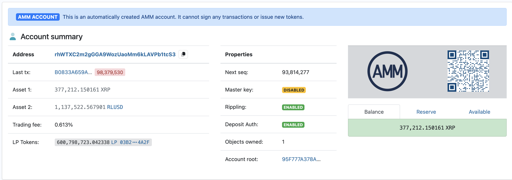

📘 Project Guidelines – XRP Explorer

🎯 Objectif du projet
Fournir un explorateur XRP moderne, rapide et fiable, centré sur:
1) Statistiques globales: ledger index, actualisation, supply, non-escrow, prix XRP/USD, #portefeuilles, distribution des soldes et pourcentages.
2) Exploration d’adresses: recherche, QR code, balance, tokens IOUs, transactions récentes, plus gros dépôts/retraits, flags/propriétés.
3) Qualité: UX simple, performance (cache/ISR), accessibilité, maintenabilité long terme.

Voici 2 images qui peuvent servir d'exemples :

⸻

⚡ Choix technologiques

🔹 Backend
• Node.js + Fastify (TypeScript) pour la rapidité et l’ergonomie, avec OpenAPI (Swagger) auto-généré.
• xrpl.js (WebSocket) comme client principal XRPL, Ripple Data API en fallback/agrégation (ledger, comptes, txs).
• Validation d’entrées via Zod, mapping DTOs propre, rate limiting par IP/clé.
• Orchestration des tâches: BullMQ (sur Redis) pour ingestions programmées, snapshots et recalculs.
• Observabilité: Sentry (erreurs), OpenTelemetry (traces), endpoints /health et /ready.

🔹 Base de données
• PostgreSQL (Neon ou Supabase managé) pour la fiabilité, JSONB au besoin.
• Schéma initial (indicatif):
  - accounts(id, address unique, created_at, updated_at, flags, owner_count)
  - account_balances(account_id FK, xrp_balance_drops, updated_at)
  - token_balances(account_id FK, currency, issuer, value_decimal, updated_at)
  - transactions(id, hash unique, account_id FK, type, amount_drops, fee_drops, result, ledger_index, tx_ts)
  - metrics_snapshots(id, ts, ledger_index, total_xrp_drops, non_escrow_xrp_drops, wallets_count, price_usd)
  - price_history(id, ts, price_usd)
• Indexation: address, ledger_index, tx_ts, (currency, issuer), btree + GIN pour recherches rapides.
• ORM: Prisma pour productivité et migrations fiables.

🔹 Frontend
• Next.js (App Router) + TypeScript + Tailwind CSS + shadcn/ui pour une UI moderne.
• Graphiques: Chart.js (simplicité, bundle raisonnable).
• i18n: next-intl (fr/en), dark mode natif, composants accessibles.
• ISR (Incremental Static Regeneration) pour pages Stats/RichList, data fetching côté serveur, cache revalidé.

🔹 Hébergement
• Frontend: Vercel (builds rapides, ISR et edge).
• API + Worker: Fly.io ou Render (concurrence flexible, déploiement simple).
• DB: Neon/Supabase (Postgres managé).
• Cache/Queue: Upstash Redis (serverless).
• Surveillance: Sentry, Uptime (Healthchecks), logs structurés (JSON).

Justification: ces choix maximisent la rapidité (Fastify/ISR/cache), la simplicité (TypeScript partout), et la maintenabilité (Prisma, conventions strictes).

⸻

🛠️ Organisation du projet

📂 Arborescence proposée (monorepo)
xrp-richlist/
│── apps/
│   ├── web/           # Next.js (UI)
│   ├── api/           # Fastify (REST + Swagger)
│   └── worker/        # BullMQ jobs (cron ingest, snapshots)
│── packages/
│   ├── config/        # eslint, tsconfig, tailwind, shared configs
│   ├── types/         # schémas Zod/Types partagés
│   └── ui/            # composants réutilisables
│── prisma/            # schema.prisma, migrations
│── .github/workflows/ # CI
│── docker/            # compose, Dockerfiles
│── README.md
│── guidelines.md      # Ce fichier

Conventions & qualité
• Commits: Conventional Commits (feat:, fix:, chore:…).
• Branching: GitHub Flow (feature branches + PR).
• Code style: ESLint + Prettier (CI bloquante).
• Tests: Vitest (unit), Playwright (E2E UI critiques).
• Review: 1 LGTM + CI green.

🔄 Flux de données

1) Acquisition
• Prix: CoinGecko (API simple, key optionnelle), fallback secondaire si nécessaire.
• Ledger & Comptes: xrpl.js (WebSocket) pour infos temps réel (ledger index), Ripple Data API pour agrégations (wallet count, txs par compte).
• Worker planifie:
  - cron_1m: actualise ledger index, prix, snapshots rapides
  - cron_5m: recalcul distribution et pourcentages
  - cron_15m: enrichit rich list/top wallets
  - cron_daily: compaction, archives, vacuum

2) Stockage
• Écritures via Prisma (transactions atomiques).
• Historisation: metrics_snapshots + price_history pour les graphes.

3) Exposition API
• GET /api/metrics → métriques globales + horodatage
• GET /api/richlist → top wallets + agrégations
• GET /api/address/:address → profil, flags, balances, tokens
• GET /api/address/:address/txs?limit=…&cursor=… → pagination
• Tous les endpoints: cache Redis (clé basée sur params, TTL court), ETag/Last-Modified.

4) Cache & Revalidation
• Couche Redis en lecture pour la majorité des pages.
• Pages ISR revalidées sur webhook interne (revalidate tag) déclenché par worker.
• Stratégie TTL:
  - Metrics: 30–60s
  - Address: 60–120s
  - RichList/Distribution: 5–15 min

5) Temps réel
• Optionnel (phase ultérieure): WebSocket SSE/WS pour dernier ledger.

Performance & budgets
• TTFB < 200 ms (côté serveur, cache chaud).
• LCP < 2.0 s sur mobile cible (Fast 3G).
• JS < 150 kB gzip initial (code-splitting, charts lazy).
• Images: next/image, formats modernes.

Sécurité
• Validation stricte Zod côté API.
• Rate limit par IP/route (soft + hard).
• CORS: allowlist stricte (prod).
• Headers: CSP, HSTS, X-Frame-Options, Referrer-Policy.
• Secrets: via variables d’environnement; jamais commit.
• Journalisation: PII minimale, rotation des logs.

Monitoring & SRE
• Sentry (frontend/backend), traçage OTel.
• /health (dépendances critiques), /ready (readiness).
• Uptime: Healthchecks pour cron/worker.
• Alertes sur erreurs fatales, temps de réponse > seuil.

⸻

🎨 UX & UI

Principes
• Lisible, structuré, hiérarchie claire, sobriété visuelle.
• Mobile-first, dark mode, A11y AA minimum (contraste, focus, ARIA).

1) Page d’accueil / Stats
• Cartes métriques: ledger index, horodatage, total supply, non-escrow, prix USD, #wallets.
• Graphiques: 
  - Distribution par tranches (ex: 0–10, 10–100, 100–1k, 1k–10k, >10k XRP).
  - Pourcentage des comptes par tranche.
• CTA vers Rich List et Recherche.

2) Rich List
• Tableau triable, pagination, colonnes: rank, address (copiable), balance, % supply.
• Filtres: min balance, tags connus (exchanges).

3) Page recherche adresse
• Barre de recherche: validation live des adresses XRP.
• Header: QR code, address copiable, flags (readonly).
• Sections:
  - Solde & tokens (IOUs): table avec pagination.
  - Transactions récentes: type, montants, fees, résultats.
  - Plus gros dépôts/retraits: top N agrégés.
• Liens profonds: “Voir plus de transactions”.

4) Navigation
• [Stats] | [Recherche adresse] | [Top Wallets].
• Breadcrumbs contextuels.
• Recherche accessible (⌘K) optionnelle.

5) Feedback & état
• Skeletons & loaders pour données lentes.
• Empty states clairs, messages d’erreur actionnables.

Critères d’acceptation
• Temps d’affichage initial < 2 s (connexion moyenne).
• Score Lighthouse ≥ 90 (Perf/Best Practices/SEO), A11y ≥ 95.
• Requêtes API principales < 300 ms (cache chaud).
• Pas de crash sur entrée invalide (validation).

⸻

📦 Livrables attendus par étapes
• v0.1: API /metrics, page Stats avec cartes + 1 graphe, ISR+cache.
• v0.2: /address/:r… + transactions récentes, QR, flags.
• v0.3: Rich List complète + distribution + top transferts.
• v0.4: i18n, thèmes, monitoring complet.

⸻
